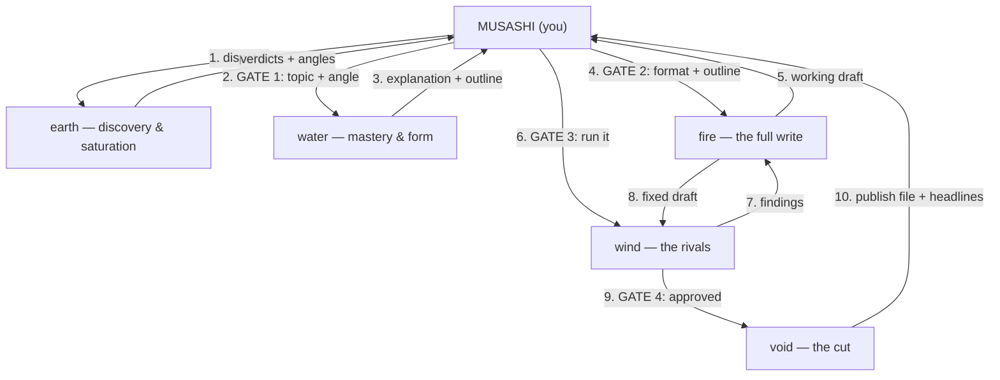

# Rings Roster — Agent Reference

The Go Rin No Sho command structure for this workspace. 5 scroll masters (dispatched by
you, Musashi the author), each commanding a squad of max 2 technique-disciples — one
Chinese, one Indian. Every report ends with **Next ring:** — a handoff recommendation;
you always do the actual dispatch.

- Scrolls: `model: inherit` — full session capability.
- Disciples: `model: sonnet` — focused, cheaper strikes. Also directly dispatchable when one focused strike is enough.
- Squad limits: depth hard-capped at 2 (`CLAUDE_CODE_MAX_SUBAGENT_SPAWN_DEPTH` in `.claude/settings.json`); disciples have no `Agent` tool and can never spawn further.
- Definitions live in `.claude/agents/*.md`. Style law lives in `.claude/house-style.md`.
- Optional third-party skills: `paper-lookup` and `citation-management` (vendored under `skills/`, MIT, from K-Dense-AI/scientific-agent-skills). gewu and pramana use them when installed; both degrade gracefully without.

## The lifecycle flow

## How a mission runs

1. **earth** maps the terrain: coverage, saturation verdicts, topic quality verdicts (score /35, information gain, 30-second promise), 2–3 angles — each labeled idea | assumption | prediction | located evidence | decision (or recommended topics if you dispatched blank).
2. ★ **GATE 1** — you approve the topic and the angle.
3. **water** masters the material (manana: naive explanation → gaps closed from primary sources → rebuild) and shapes it (wenxin: format recommendation + outline). Residual gaps come to you here.
4. ★ **GATE 2** — you approve the format and the outline.
5. **fire** writes the entire working draft in one strike (wuwei: flow draft; nidarshana: hooks and parables woven through).
6. ★ **GATE 3** — you read the raw draft and direct the critique.
7. **wind** states the rival case (purvapaksha) and interrogates every claim (mingshi); findings go to fire for fixes; wind re-verifies. Max 2 rounds, then residuals — split author-facing vs pipeline-internal — come to you.
8. ★ **GATE 4** — you approve the resolved draft.
9. **void** cuts: zhijian's kill list, sutra's compression → the clean FCC-format publish file + headline package (3 scored titles). Final read: `check-house-style.sh` for the countable half, manual pass for the rest.
10. ★ **PUBLISH** — you review the publish file, pick the title, ship it.

## The scrolls

### earth — discovery & saturation (地)
- **Work:** Maps what the world already says about a topic and whether the territory is owned. Produces topic quality verdicts and 2–3 angles, each labeled idea | assumption | prediction | located evidence | decision — never blurred.
- **In the flow:** Always first. Never writes — terrain only.
- **Handoffs:** → water (angle chosen). → none (every idea rejected — pick another).

### water — mastery & form (水)
- **Work:** Proves the explanation is teachable (manana's Vedantic cycle under the Feynman standard: plain language, zero jargon, gaps closed from primary sources). Recommends the format and builds the outline (wenxin).
- **In the flow:** After Gate 1. The gate between "an angle" and "a buildable outline".
- **Handoffs:** → fire (outline approved). → author (residual gaps — never guessed).

### fire — the full write (火)
- **Work:** One committed pass over the whole article in the author's voice. The working file with internal scaffolding lives here.
- **In the flow:** After Gate 2. Also the fix loop's hands — wind's findings return here.
- **Handoffs:** → wind (draft complete, or fixes done).

### wind — the rivals (風)
- **Work:** Steel-mans the opposing view, interrogates every claim against reality, enforces the anti-gatekeeping and uncertainty-marker rules. Verdicts: approve | approve-with-residuals | reject.
- **In the flow:** After Gate 3, and after every fix round. Max 2 rounds, then residuals to you — author-facing (content gaps) separated from pipeline-internal (squad process notes).
- **Handoffs:** → fire (findings need fixes). → void (approved).

### void — the cut (空)
- **Work:** Subtracts the habitual and the fatal (zhijian), compresses and casts the clean publish file + headline package (sutra). Final read: `.claude/scripts/check-house-style.sh` first (gatekeeping words, limits, semicolons, metadata, identifiers, title length, visual breaks), then the manual pass for what it can't count.
- **In the flow:** After Gate 4. Output goes to you — publishing is the author's act.
- **Handoffs:** → fire (structural kills). → none (ready to publish).

## The 10 disciples (directly dispatchable too)

| Disciple | Squad | Tools | Work |
|---|---|---|---|
| `gewu` | earth | read + web | 格物致知 — terrain sweeps: coverage maps, community pain signals, search logs with min. 3 source types (0-result rows logged too). |
| `pramana` | earth | read + web | प्रमाण — evidence grading Tier 1/2/3 into claim-ledger rows; saturation verdicts: owned vs open, citing the strongest existing piece by name. |
| `manana` | water | read + web | श्रवण→मनन→निदिध्यासन — the mastery cycle: naive explanation, gap manifest, gaps closed from primary sources, rebuilt until it survives retelling. |
| `wenxin` | water | read-only | 文心 — format recommendation from the library; the outline carved from the proven explanation. |
| `wuwei` | fire | full | 無為 — the complete flow draft in one pass; holes marked, momentum kept. |
| `nidarshana` | fire | full | निदर्शन — hooks, parables, illustrations woven through without breaking momentum. |
| `purvapaksha` | wind | read + web | पूर्वपक्ष — the rival case stated so fairly its side would sign it; agreement is not a valid outcome (no objection found must show its empty searches). |
| `mingshi` | wind | read + web | 名實 — name-vs-reality on every claim, cross-checked against the claim ledger; anti-gatekeeping and uncertainty-marker enforcement. |
| `zhijian` | void | read + web + edit | 至簡 — the kill list: habit sentences and failure modes subtracted in place (subtraction only — a rephrase is a structural return); structural kills flagged to fire. |
| `sutra` | void | full | सूत्र — compression to house-style limits, counted not felt; `[Visual break: ...]` markers; the clean publish file; headline package (3 scored titles). |

## Dispatch guide — when to summon whom

**Pick by the question you're asking, not by habit:**

| Your situation | Dispatch |
|---|---|
| "I have an idea — is it worth writing?" | **earth** |
| "I have no idea what the community is talking about" | **earth** (blank dispatch — it recommends topics) |
| "Is this area saturated?" | **pramana** directly (cheap strike) |
| "Topic and angle chosen — make me an outline" | **water** |
| "Just the naive explanation for this topic" | **manana** directly |
| "Outline approved — write it" | **fire** |
| "Draft done — try to kill it" | **wind** |
| "Approved — make it publishable" | **void** |
| "Just check my claims" | **mingshi** directly |

**Efficiency rules:**

1. **Don't skip earth.** earth → water → fire → wind → void is the quality chain; every skipped link is rework later.
2. **Dispatch a disciple directly for a focused strike** — pramana for one saturation check, manana for one explanation. Cheaper than a full scroll pass.
3. **One mission, one scroll.** Each handoff gets a fresh-context agent and a **Next ring:** recommendation.
4. **Squads run inside their scroll** (earth runs gewu → pramana; water runs manana → wenxin). Dispatch the scroll, not the squad.
5. **Water's gaps never route to earth.** manana closes its own gaps from primary sources; unclosable ones come to you at Gate 2.
6. **Read-only disciples are cheap; scrolls are not.** For pure questions, dispatch the disciple.
7. **Blocked is a verdict, not a guess.** A disciple that cannot complete its mission
   returns `Next ring: none — blocked, need author` — never fabricate.
